# Hi there 👋, I'm Hasan Razu

I'm a **Database Support Engineer** with a background in Computer Science and Engineering, passionate about **Oracle Database, SQL, PL/SQL, software development, and enterprise applications**.

Currently, I work at **Sonali Intellect Limited** in a banking technology environment associated with **Sonali Bank PLC**, focusing on database support, Oracle SQL/PLSQL, Core Banking System (CBS), troubleshooting, and enterprise database operations.

I also have a software development background with experience in **Java, Python, Spring Boot, Spring MVC, React**, and database technologies.

## 🔭 Current Technical Focus

* Oracle Database
* Oracle SQL
* PL/SQL
* Database Support & Troubleshooting
* Core Banking System (CBS)
* Banking Database Environment
* TOAD
* PL/SQL Developer
* Database Objects & SQL/PLSQL Development
* Enterprise Applications

## 🚀 Projects

### 1. Coaching Center Management - Spring Web MVC

A web-based coaching center management system developed using Spring MVC.

🔗 [View Repository](https://github.com/hasanRAZU/coaching-center-management-springboot-mvc)

### 2. Mood-Based Quote Music Recommender

A project that recommends quotes and music based on the user's mood.

🔗 [View Repository](https://github.com/hasanRAZU/Mood-Based-Quote-Music-Recommender)

### 3. Calorie Care Mobile Application

A Java-based mobile application focused on calorie and health-related tracking.

🔗 [View Repository](https://github.com/hasanRAZU/Calorie-Care-Mobile-Application-using-Java)

### 4. Two Level Encoding-Decoding

A Java-based project implementing a two-level encoding and decoding mechanism.

🔗 [View Repository](https://github.com/hasanRAZU/TwoLevelOf-EncodingDecoding-using-Java)

### 5. Chat Application

A Java-based chat application demonstrating client-server communication.

🔗 [View Repository](https://github.com/hasanRAZU/Chat-Application-using-Java)

## 🛠 Skills & Tech Stack

### Programming Languages

### Frameworks & Development

### Databases

### Database Tools

### Tools & Platforms

## 🏦 Banking & Database Experience

* Core Banking System (CBS)
* Banking database structures
* Oracle SQL and PL/SQL
* Database troubleshooting and support
* Account and customer database structures
* Database objects and SQL development
* Enterprise database environments
* Practical SQL query development
* Database support activities

## 📊 GitHub Stats

## 🎯 Career Goal

**Database Engineering → Oracle & PL/SQL → Enterprise Applications → Software Development → Banking Technology**

## 📫 Contact Me

* 📧 Email: [hasanrazu.cse.193.gub@gmail.com](mailto:hasanrazu.cse.193.gub@gmail.com)
* 💼 LinkedIn: [linkedin.com/in/hasanRAZU](https://linkedin.com/in/hasanRAZU)
* 🐙 GitHub: [github.com/hasanRAZU](https://github.com/hasanRAZU)

---

⭐ Feel free to explore my repositories and projects.
